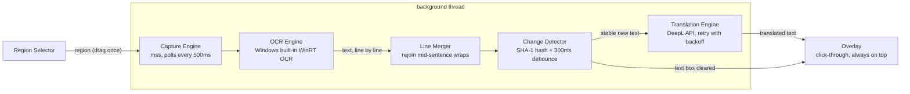

# VNLens

[](https://github.com/hoanglong1208/vnlens/actions/workflows/ci.yml)
[](https://github.com/hoanglong1208/vnlens/releases/latest)
[](LICENSE)

Real-time screen translator overlay for visual novels and text-heavy games.

VNLens watches a region of your screen, recognizes the text inside it, translates it to Vietnamese, and shows the result in a transparent click-through overlay anchored right below the game's text box. You never leave the game: no alt-tabbing, no copy-paste, no second monitor.

Windows 10/11 only. Open source under MIT.

## Download

Grab the latest `VNLens-vX.Y.Z.exe` from the [Releases page](https://github.com/hoanglong1208/vnlens/releases/latest) — single file, no installation needed.

> Windows SmartScreen may warn because the executable is not code-signed. Click "More info" then "Run anyway".

## How it works



1. **Select once.** On first run you drag a rectangle around the game's text box. The region is stored as screen fractions, so it survives resolution changes.
2. **Capture.** A background thread grabs the region with `mss` (~1ms per frame) every 500ms.
3. **Recognize.** Windows' built-in WinRT OCR reads the text line by line — no model downloads, no GPU, English and Japanese language packs ship with Windows.
4. **Rebuild lines.** Game text boxes wrap long sentences mid-way; translating those fragments separately ruins quality. Lines ending without sentence punctuation are rejoined, while breaks after a finished sentence are kept — so the translation follows the original line structure.
5. **Detect change.** The normalized text is hashed (SHA-1) and compared with the previous frame. Identical text is skipped, so the API is never called twice for the same line. A 300ms debounce waits out typewriter-style text reveal before translating.
6. **Translate.** New stable text goes to the configured provider (DeepL by default), with up to 3 attempts and exponential backoff. Results render in the overlay with a fade-in; when the game clears its text box, the overlay fades out.

The overlay uses the Win32 `WS_EX_TRANSPARENT` style, so mouse clicks pass straight through it to the game.

## Tech stack

| Area           | Technology                   | Why                                                                 |
| -------------- | ---------------------------- | ------------------------------------------------------------------- |
| Language       | Python 3.12                  | Fast iteration, strong OCR/imaging ecosystem, easy to contribute to |
| GUI / overlay  | PyQt6                        | GPU-accelerated, frameless translucent windows, system tray         |
| Screen capture | mss                          | ~1ms per grab, no dependencies on game internals                    |
| OCR            | Windows WinRT OCR (`winsdk`) | Built into Windows 10/11, ~80ms latency, zero install               |
| Translation    | DeepL API (`deepl`)          | Best quality among free-tier providers (500k chars/month)           |
| Hotkeys        | pynput                       | Global hotkeys that work while the game has focus                   |
| Config         | Pydantic v2                  | Validated config schema, stored as JSON                             |
| Secrets        | Windows DPAPI (`ctypes`)     | API keys encrypted per Windows user account, never plaintext        |
| Packaging      | PyInstaller                  | Single-file `VNLens.exe`                                            |
| Tooling        | uv, ruff, pytest             | Dependency lockfile, lint/format, tests                             |

Planned next: Google Translate / LibreTranslate / Claude providers, EasyOCR fallback for bitmap fonts, SQLite translation cache, per-game profiles. See the roadmap in the project plan.

## Usage

- **F2** — pause / resume translation
- **F3** — pick a new capture region
- **F4** — move the overlay: a dashed border appears and the box can be dragged anywhere; press F4 again to lock it. "Bám dưới vùng chọn" in the tray menu snaps it back under the capture region.
- The anchored overlay automatically flips above the capture region when there is no room below (text boxes usually sit at the bottom of the screen) and never leaves the visible screen.
- Tray icon shows the current state: green (translating), yellow (waiting), red (API error), gray (paused)
- Double-click the tray icon (or tray menu > "Cài đặt") to open the settings dashboard: translation provider and API key, overlay font size / background opacity / text color / shadow with live preview, OCR source language, capture poll interval, and hotkey bindings. Changes apply immediately, no restart needed.
- Logs are written to `%APPDATA%\VNLens\vnlens.log`, config to `%APPDATA%\VNLens\config.json`

On first run a 3-step wizard asks for your translation provider and API key, verifies the connection with a sample sentence, then lets you pick the capture region.

## Development

Requires [uv](https://docs.astral.sh/uv/). Code is developed on any OS, but the app only runs on Windows (WinRT OCR, DPAPI, click-through overlay are Windows APIs).

```
uv sync
uv run vnlens
```

Tests and lint:

```
uv run pytest
uv run ruff check
```

## Build

On Windows:

```
uv run python build.py
```

Produces the single-file executable at `dist/VNLens.exe`.

## Project layout

```
src/vnlens/
├── main.py          # App controller: wires everything, owns the Qt event loop
├── core/pipeline.py # Capture -> OCR -> detect -> translate loop (background thread)
├── capture/         # mss screen grab + drag-to-select region overlay
├── ocr/             # BaseOCR interface, WinRT implementation
├── translation/     # TranslationProvider interface, DeepL, retry, registry
├── overlay/         # Click-through translation overlay + text rendering
├── ui/              # System tray, first-run wizard
├── config/          # Pydantic schema + JSON load/save
└── utils/           # Change detection, line merging, hotkeys, DPAPI, resources
```

OCR engines and translation providers are pluggable: implement `BaseOCR` or `TranslationProvider` and register it — callers only depend on the interface.

## License

MIT
