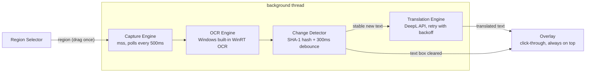

# VNLens

Real-time screen translator overlay for visual novels and text-heavy games.

VNLens watches a region of your screen, recognizes the text inside it, translates it to Vietnamese, and shows the result in a transparent click-through overlay anchored right below the game's text box. You never leave the game: no alt-tabbing, no copy-paste, no second monitor.

Windows 10/11 only. Open source under MIT.

## How it works



1. **Select once.** On first run you drag a rectangle around the game's text box. The region is stored as screen fractions, so it survives resolution changes.
2. **Capture.** A background thread grabs the region with `mss` (~1ms per frame) every 500ms.
3. **Recognize.** Windows' built-in WinRT OCR reads the text — no model downloads, no GPU, English and Japanese language packs ship with Windows.
4. **Detect change.** The raw text is hashed (SHA-1) and compared with the previous frame. Identical text is skipped, so the API is never called twice for the same line. A 300ms debounce waits out typewriter-style text reveal before translating.
5. **Translate.** New stable text goes to the configured provider (DeepL by default), with up to 3 attempts and exponential backoff. Results render in the overlay with a fade-in; when the game clears its text box, the overlay fades out.

The overlay uses the Win32 `WS_EX_TRANSPARENT` style, so mouse clicks pass straight through it to the game.

## Tech stack

| Area           | Technology                   | Why                                                                 |
| -------------- | ---------------------------- | ------------------------------------------------------------------- |
| Language       | Python 3.12                  | Fast iteration, strong OCR/imaging ecosystem, easy to contribute to |
| GUI / overlay  | PyQt6                        | GPU-accelerated, frameless translucent windows, system tray         |
| Screen capture | mss                          | ~1ms per grab, no dependencies on game internals                    |
| OCR            | Windows WinRT OCR (`winsdk`) | Built into Windows 10/11, ~80ms latency, zero install               |
| Translation    | DeepL API (`deepl`)          | Best quality among free-tier providers (500k chars/month)           |
| Hotkeys        | pynput                       | Global hotkeys that work while the game has focus                   |
| Config         | Pydantic v2                  | Validated config schema, stored as JSON                             |
| Secrets        | Windows DPAPI (`ctypes`)     | API keys encrypted per Windows user account, never plaintext        |
| Packaging      | PyInstaller                  | Single-file `VNLens.exe`                                            |
| Tooling        | uv, ruff, pytest             | Dependency lockfile, lint/format, tests                             |

Planned next: Google Translate / LibreTranslate / Claude providers, EasyOCR fallback for bitmap fonts, SQLite translation cache, per-game profiles. See the roadmap in the project plan.

## Usage

- **F2** — pause / resume translation
- **F3** — pick a new capture region
- Tray icon shows the current state: green (translating), yellow (waiting), red (API error), gray (paused)
- Logs are written to `%APPDATA%\VNLens\vnlens.log`, config to `%APPDATA%\VNLens\config.json`

On first run a 3-step wizard asks for your translation provider and API key, verifies the connection with a sample sentence, then lets you pick the capture region.

## Development

Requires [uv](https://docs.astral.sh/uv/). Code is developed on any OS, but the app only runs on Windows (WinRT OCR, DPAPI, click-through overlay are Windows APIs).

```
uv sync
uv run vnlens
```

Tests and lint:

```
uv run pytest
uv run ruff check
```

## Build

On Windows:

```
uv run python build.py
```

Produces the single-file executable at `dist/VNLens.exe`.

## Project layout

```
src/vnlens/
├── main.py          # App controller: wires everything, owns the Qt event loop
├── core/pipeline.py # Capture -> OCR -> detect -> translate loop (background thread)
├── capture/         # mss screen grab + drag-to-select region overlay
├── ocr/             # BaseOCR interface, WinRT implementation
├── translation/     # TranslationProvider interface, DeepL, retry, registry
├── overlay/         # Click-through translation overlay + text rendering
├── ui/              # System tray, first-run wizard
├── config/          # Pydantic schema + JSON load/save
└── utils/           # Change detection, hotkeys, DPAPI, resources
```

OCR engines and translation providers are pluggable: implement `BaseOCR` or `TranslationProvider` and register it — callers only depend on the interface.

## License

MIT
